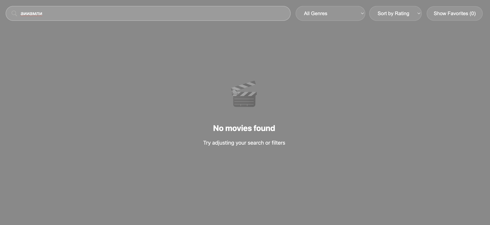

# Anime Dashboard

Современное веб-приложение для управления коллекцией аниме с возможностью поиска, фильтрации и добавления в избранное.

## Особенности

-  **Умный поиск** - поиск по названию и режиссёру

-  **Фильтрация по жанрам** - поддержка множественных жанров для каждого аниме

-  **Сортировка** - по названию, рейтингу или году выпуска

-  **Избранное** - сохранение любимого аниме с localStorage

-  **Адаптивный дизайн** - работает на всех устройствах

-  **Быстрая работа** - оптимизированные рендеринг и фильтрация



## Технологии

- **React** 18.x 
- **Redux Toolkit** 
- **React Redux** 
- **CSS3** 
- **localStorage API** 

##  Установка и запуск

### Требования

- Node.js >= 14.x
- npm >= 6.x или yarn >= 1.22.x

### Шаги установки

1. **Клонируйте репозиторий**

```bash
git clone https://github.com/yourusername/anime-dashboard.git
cd anime-dashboard
```

2. **Установите зависимости**

```bash
npm install
# или
yarn install
```

3. **Запустите приложение**

```bash
npm start
# или
yarn start
```

4. Откройте браузер и перейдите на `http://localhost:3000`
